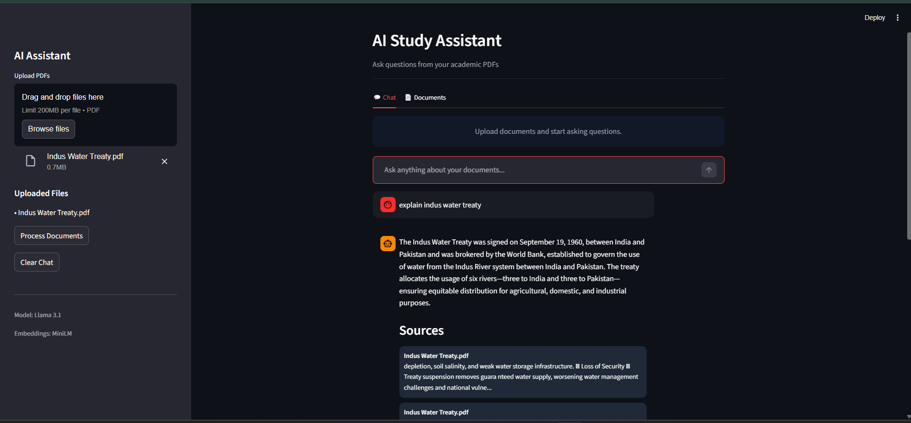

# AI Study Assistant

An AI-powered document assistant that enables users to interact with PDFs using **Retrieval-Augmented Generation (RAG)**.

---

## 🚀 Features

* 📄 Upload and query multiple PDFs
* 🔍 Semantic search using embeddings
* 🧠 Context-aware answers strictly grounded in documents
* 🚫 Hallucination control with deterministic fallback ("not found")
* 💬 Chat-based interface (Streamlit)
* 📌 Source attribution for transparency

---

## 🧠 How It Works

1. PDFs are parsed and split into overlapping chunks
2. Chunks are converted into embeddings using Sentence Transformers
3. Stored in a vector database (ChromaDB)
4. User query → converted into embedding
5. Top relevant chunks retrieved
6. LLM (Llama 3.1 via Ollama) generates answer **strictly from context**

---

## 🛠 Tech Stack

* **Frontend**: Streamlit
* **LLM**: Llama 3.1 (Ollama)
* **Embeddings**: Sentence Transformers (MiniLM)
* **Vector DB**: ChromaDB
* **Language**: Python

---

## ▶️ Run Locally

```bash
pip install -r requirements.txt
streamlit run app.py
```

---

## ⚠️ Notes

* Works best with **text-based PDFs** (not scanned documents)
* Requires **Ollama installed locally**
* No external APIs used (fully local setup)

---

## 🎯 Future Improvements

* OCR support for scanned PDFs
* Improved document filtering
* Multi-file context separation
* UI enhancements
* Deployment (Streamlit Cloud / Docker)

---

## 📸 Demo



---

## 👤 Author

**Nyasha Chauhan**
AI/ML Engineer | Building Intelligent Systems
