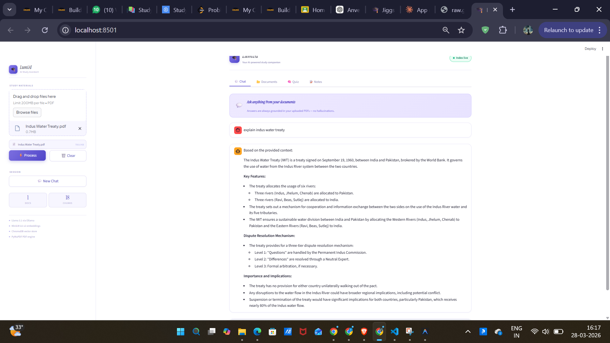
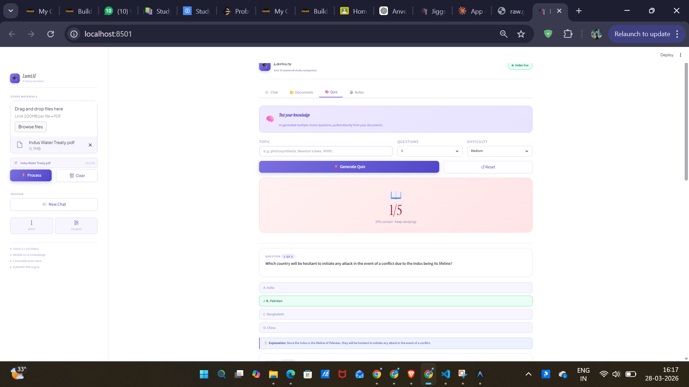
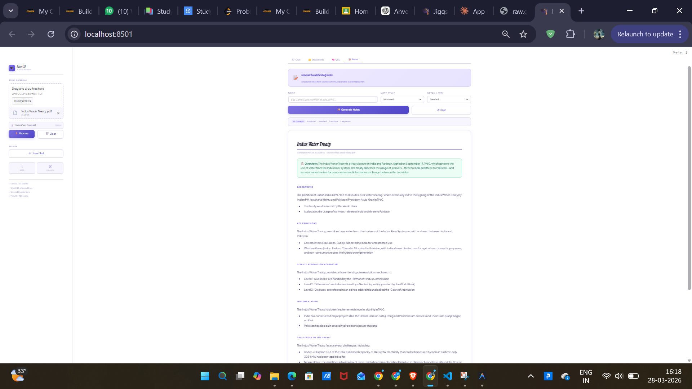

# LumiAI

A personal AI study assistant that runs entirely on your machine. Drop in your PDFs — textbooks, lecture notes, research papers — and start asking questions, generating quizzes, or building study notes without touching the internet.

I built this because most RAG demos stop at a chat interface. LumiAI goes a bit further: it lets you actually study with your documents, not just search them.

---

## Screenshots


### Chat


### Quiz


### Notes


---

## What it does

**Chat** — Ask questions about your uploaded PDFs. Answers are pulled directly from your documents, with sources shown below each response.

**Documents** — A quick overview of everything indexed: how many files, how many chunks, ready status.

**Quiz** — Pick a topic and difficulty, and the app generates multiple choice questions from your material. Answers are scored and explained at the end.

**Notes** — Generate structured study notes in different formats (Cornell, Mind Map, Exam Cram, etc.) and download them as a clean PDF.

---

## Stack

- [Streamlit](https://streamlit.io) — UI
- [Llama 3.1](https://ollama.com/library/llama3.1) via [Ollama](https://ollama.com) — LLM
- [sentence-transformers](https://www.sbert.net) (`all-MiniLM-L6-v2`) — embeddings
- [ChromaDB](https://www.trychroma.com) — local vector store
- [PyMuPDF](https://pymupdf.readthedocs.io) — PDF text extraction
- [ReportLab](https://www.reportlab.com) — PDF export for notes

---

## Setup

You'll need Python 3.9+ and [Ollama](https://ollama.com) installed.

```bash
# Pull the model
ollama pull llama3.1

# Clone and install
git clone https://github.com/nyashachauhan0138-hash/ai-study-assistant.git
cd ai-study-assistant
pip install -r requirements.txt

# Run
streamlit run app.py
```

Open [http://localhost:8501](http://localhost:8501) and you're good to go.

---

## Project structure

```
ai-study-assistant/
├── app.py              # everything lives here
├── requirements.txt
├── README.md
└── chroma_db/          # created automatically on first run
```

---

## Tweakable settings

These are all at the top of `app.py` if you want to experiment:

| Setting | Default | Notes |
|---|---|---|
| LLM model | `llama3.1` | swap for any Ollama model |
| Embedding model | `all-MiniLM-L6-v2` | good balance of speed vs quality |
| Chunk size | `800` chars | smaller = more precise retrieval |
| Chunk overlap | `150` chars | helps with context across boundaries |
| ChromaDB path | `./chroma_db` | change if you want a shared store |

---

## Privacy

Everything runs locally. No API keys, no data leaving your machine. Your documents stay yours.

---

## License

MIT

---

## Author

**Nyasha Chauhan** — [@nyashachauhan0138-hash](https://github.com/nyashachauhan0138-hash)